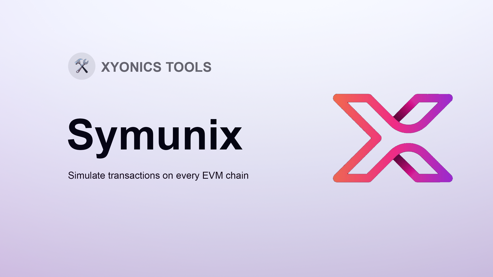

# Ethereum Transaction Simulator - Symunix

[](https://github.com/xyonics/Symunix/actions/workflows/test.yaml)



Welcome to Symunix, your go-to Ethereum Transaction Simulator. This tool offers a streamlined HTTP API enabling simulation of transaction requests on a local EVM.

## 📫 API Overview 📫

### POST /api/v1/simulate

Simulates a single transaction on the local EVM.

[Refer below for full request and response types.](#types)

Sample request body:

```json
{
  "chainId": 1,
  "from": "0x76e40D0a69Fd81826B5eb7D18145626d46EAFdef",
  "to": "0xA69babEF1cA67A37Ffaf7a485DfFF3382056e78C",
  "data": "0x78e111f6000000000000000000000000d115bbf5da7bd37f67b0467c3617257bc1580520000000000000000000000000000000000000000000000000000000000000004000000000000000000000000000000000000000000000000000000000000000c42f1c6b5000000000000000000000000000000000000000000000000b5a32cd9820e4f9fa0000000000000000000000000000000000000000000000000035e45b6928f63400000000000000000000000000000000000000000000417111f8efa545520b730000000000000000000000000000000000000000000000000017887ee210e63c000000000000000000000000000000000000000000000000000000006590c75fff8000000000000000000000000000000000000000000000000000000001247b00000000000000000000000000000000000000000000000000000000",
  "gasLimit": 244000,
  "value": "0.000000000015600384",
  "blockNumber": 18902269,
  "formatTrace": false
}
```

Example response:

```json
{
  "gasUsed": 214622,
  "blockNumber": 18902269,
  "success": true,
  "trace": { ... },
  "logs": [ ... ],
  "exitReason": "Return"
}
```

Notes:

- `blockNumber` can be omitted and the latest block will be used, however providing a `blockNumber` is recommended where possible to use the cache.

### POST /api/v1/simulate-bundle

Simulates a bundle of transactions in order against the same EVM.

[See the full request and response types below.](#types)

Example body:

```json
[
  {
  "chainId": 1,
  "from": "0x76e40D0a69Fd81826B5eb7D18145626d46EAFdef",
  "to": "0xA69babEF1cA67A37Ffaf7a485DfFF3382056e78C",
  "data": "0x78e111f6000000000000000000000000d115bbf5da7bd37f67b0467c3617257bc1580520000000000000000000000000000000000000000000000000000000000000004000000000000000000000000000000000000000000000000000000000000000c42f1c6b5000000000000000000000000000000000000000000000000b5a32cd9820e4f9fa0000000000000000000000000000000000000000000000000035e45b6928f63400000000000000000000000000000000000000000000417111f8efa545520b730000000000000000000000000000000000000000000000000017887ee210e63c000000000000000000000000000000000000000000000000000000006590c75fff8000000000000000000000000000000000000000000000000000000001247b00000000000000000000000000000000000000000000000000000000",
  "gasLimit": 244000,
  "value": "0.000000000015600384",
  "blockNumber": 18902269,
  "formatTrace": false
}
]
```

Example response:

```json
[{
  "gasUsed": 214622,
  "blockNumber": 16784600,
  "success": true,
  "trace": { ... },
  "logs": [ ... ],
  "exitReason": "Return"
}]
```

Notes:

- `chainId` must be the same in all transactions.
- `blockNumber` can be included and incremented when a multi-block simulation is required, or omitted in all transactions to use latest.

### POST /api/v1/simulate-stateful

Starts a new stateful simulation, allowing you to persist the state of a single EVM across multiple subsequent simulation requests.

[See the full request and response types below.](#types)

Example body:

```json
[
  {
    "chainId": 1,
    "gasLimit": 500000,
    "blockNumber": 16784600
  }
]
```

Example response:

```json
[
  {
    "statefulSimulationId": "aeb708a5-81d7-4126-a0b5-0f2a78b3830e"
  }
]
```

### POST /api/v1/simulate-stateful/{statefulSimulationId}

Simulates a bundle of transactions in order against the EVM referred to by the UUID in the URL. After the result is obtained, the EVM state will be retained for subsequent requests.

[See the full request and response types below.](#types)

Example body:

```json
[
  {
  "chainId": 1,
  "from": "0x76e40D0a69Fd81826B5eb7D18145626d46EAFdef",
  "to": "0xA69babEF1cA67A37Ffaf7a485DfFF3382056e78C",
  "data": "0x78e111f6000000000000000000000000d115bbf5da7bd37f67b0467c3617257bc1580520000000000000000000000000000000000000000000000000000000000000004000000000000000000000000000000000000000000000000000000000000000c42f1c6b5000000000000000000000000000000000000000000000000b5a32cd9820e4f9fa0000000000000000000000000000000000000000000000000035e45b6928f63400000000000000000000000000000000000000000000417111f8efa545520b730000000000000000000000000000000000000000000000000017887ee210e63c000000000000000000000000000000000000000000000000000000006590c75fff8000000000000000000000000000000000000000000000000000000001247b00000000000000000000000000000000000000000000000000000000",
  "gasLimit": 244000,
  "value": "0.000000000015600384",
  "blockNumber": 18902269,
  "formatTrace": false
}
]
```

Example response:

```json
[{
  "gasUsed": 214622,
  "blockNumber": 16784600,
  "success": true,
  "trace": { ... },
  "logs": [ ... ],
  "exitReason": "Return"
}]
```

Notes:

- `chainId` must be the same in all transactions.
- `blockNumber` can be included and incremented when a multi-block simulation is required, or omitted in all transactions to use latest.

### DELETE /api/v1/simulate-stateful/{statefulSimulationId}

Ends a current stateful simulation, freeing associated memory.

[See the full request and response types below.](#types)

Example response:

```json
{
  "success": true
}
```

### Authentication

If you set an `API_KEY` environment variable then all calls to the API must be accompanied by a `X-API-KEY` header which contains this API Key.

## 🏃‍♂️ Running 🏃‍♂️

### Locally

Copy `.env.example` to `.env`, fill out required values and run:

```bash
$ cargo run
```

If you want the server to restart on any code changes run:

```bash
$ cargo watch -x run
```

## 🧪 Test 🧪

Run:

```bash
$ cargo test
```

### Manual Testing

`body.json` contains a simple request in the root of the project so once the API is running you can just run:

```bash
$ curl -H "Content-Type: application/json" --data @tests/body.json http://localhost:8080/api/v1/simulate
```

If you have `jq` installed, you can run this to see pretty traces:

```bash
$ curl -H "Content-Type: application/json" --data @tests/body.json http://localhost:8080/api/v1/simulate | jq -r ".formattedTrace"
```

## Types

```typescript
export type SimulationRequest = {
  chainId: number;
  from: string;
  to: string;
  data?: string;
  gasLimit: number;
  value: string;
  accessList?: AccessListItem[];
  blockNumber?: number; // if not specified, latest used,
  blockTimestamp?: number; // if not specified, timestamp of latest block is used,
  stateOverrides?: Record<string, StateOverride>;
  formatTrace?: boolean;
};

export type AccessListItem = {
  address: string;
  storageKeys: string[];
};

export type StateOverride = {
  balance?: string;
  nonce?: number;
  code?: string;
  state?: Record<string, string>;
  stateDiff?: Record<string, string>;
};

export type SimulationResponse = {
  simulationId: string;
  gasUsed: number;
  blockNumber: number;
  success: boolean;
  trace: CallTrace[];
  logs?: Log[];
  exitReason?: InstructionResult;
  bytes: string;
  formattedTrace?: string;
};

export type Log = {
  topics: string[];
  data: string;
  address: string;
};

export type CallTrace = {
  callType: CallType;
  from: string;
  to: string;
  value: string;
};

export enum CallType {
  CALL,
  STATICCALL,
  CALLCODE,
  DELEGATECALL,
  CREATE,
  CREATE2,
}

export enum InstructionResult {
  //success codes
  Continue,
  Stop,
  Return,
  SelfDestruct,

  // revert code
  Revert, // revert opcode
  CallTooDeep,
  OutOfFund,

  // error codes
  OutOfGas,
  OpcodeNotFound,
  CallNotAllowedInsideStatic,
  InvalidOpcode,
  InvalidJump,
  InvalidMemoryRange,
  NotActivated,
  StackUnderflow,
  StackOverflow,
  OutOfOffset,
  FatalExternalError,
  GasMaxFeeGreaterThanPriorityFee,
  PrevrandaoNotSet,
  GasPriceLessThenBasefee,
  CallerGasLimitMoreThenBlock,
  /// EIP-3607 Reject transactions from senders with deployed code
  RejectCallerWithCode,
  LackOfFundForGasLimit,
  CreateCollision,
  OverflowPayment,
  PrecompileError,
  NonceOverflow,
  /// Create init code exceeds limit (runtime).
  CreateContractLimit,
  /// Error on created contract that begins with EF
  CreateContractWithEF,
}
```